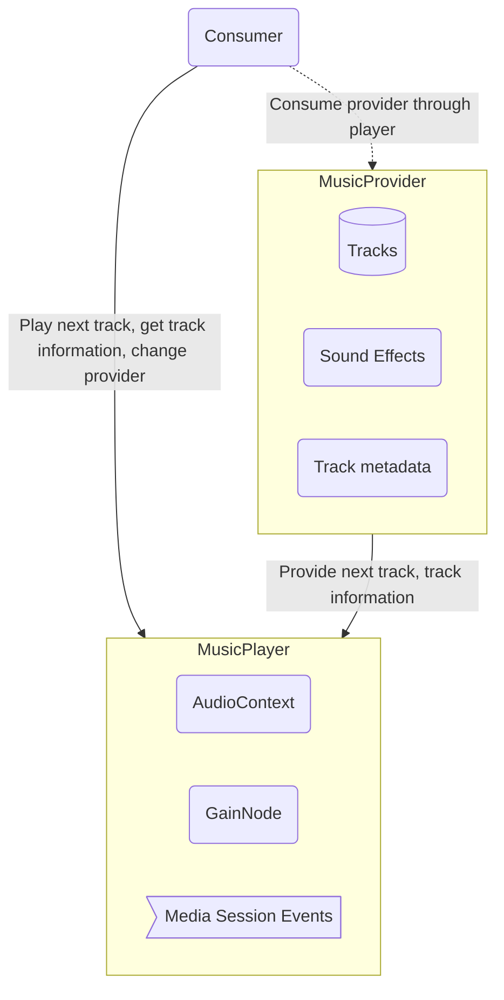

# Core functionality
Core functionality of app
- [ ] Offline first and serverless
- [ ] Desktop and android support
- [ ] Save user profile settings
  - [ ] In Cloud
  - [ ] Local files
  - [ ] Custom server
- [ ] Default apps url handler 

## File System
Requirements to file system implementation

- [ ] Providers
  - [ ] File System API
  - [ ] Yandex.Disk
  - [ ] Google Drive
  - [ ] Dropbox
- [ ] Files
  - [ ] Add
  - [ ] Update
  - [ ] Delete
  - [ ] Move
  - [ ] Copy
  - [ ] Rename
  - [ ] Get metadata
    - [ ] Name, size, date
    - [ ] Children
- [ ] Dirs
  - [ ] Add
  - [ ] Update
  - [ ] Delete
  - [ ] Move
  - [ ] Copy
  - [ ] Rename
  - [ ] Get metadata
    - [ ] Name, size, date
    - [ ] Children
- [ ] Cloud
  - [ ] Offline mode 
    - [ ] Sync when connect to internet

# UI
- [ ] Change background
- [ ] Themes

# Apps

## Music Player

### Base functionality
- [ ] Play music
- [ ] Show metadata of music file (Album/Artist/Song/Year and et al)
  - [ ] Media Session API
- [ ] Previous, next, pause/stop
- [ ] Media control integrations
- [ ] Playlists
- [ ] Music library
- [ ] Record internet stream
- [ ] Show equalizer
- [ ] Format support
  - [ ] mp3
  - [ ] ogg
- [ ] Select storage type 

## Notes

- [ ] Take notes in markdown

## Todo

- [ ] Simple todo
  - [ ] Add project
  - [ ] Description
  - [ ] Due date
  - [ ] Tags
  - [ ] Attachments
  - [ ] Move, copy, delete
- [ ] Select storage type

## Mail
## Calendar

# Release cycle

## December
- [ ] Documentation
- [ ] Test coverage > 95%
- [ ] Music player

## Januar
- [ ] Todo

## February
- [ ] Notes